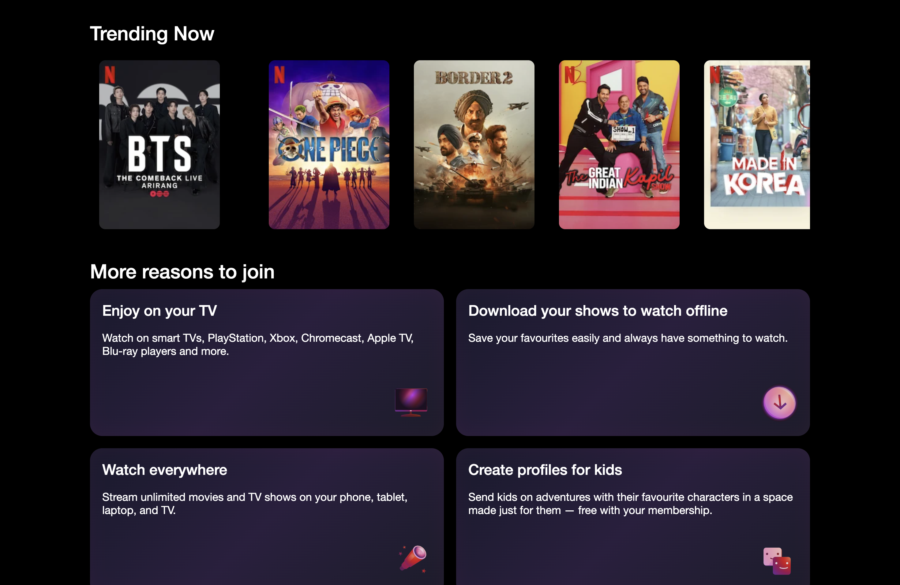
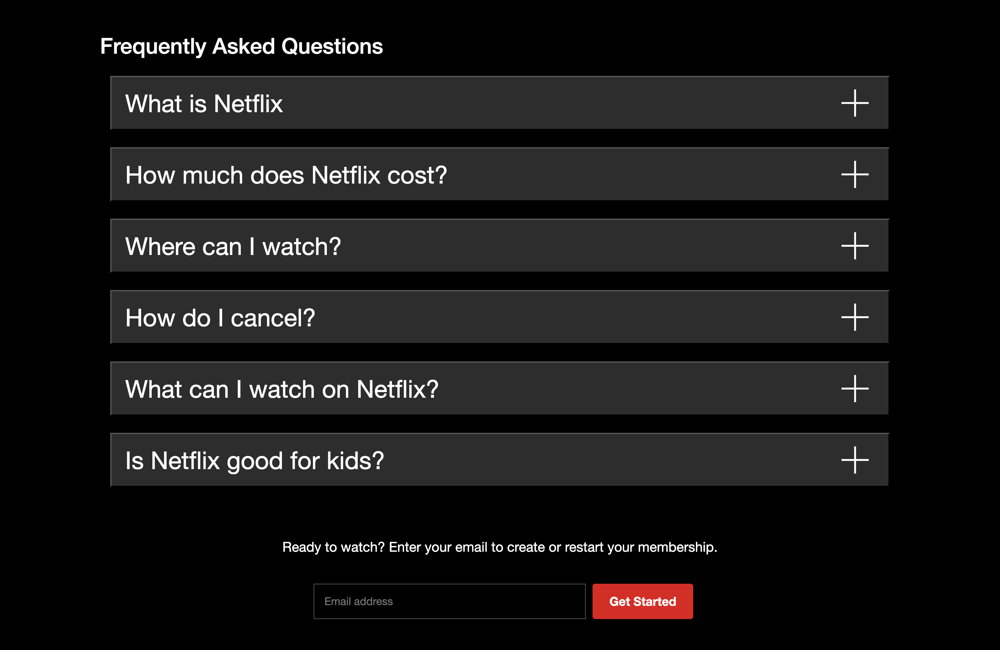
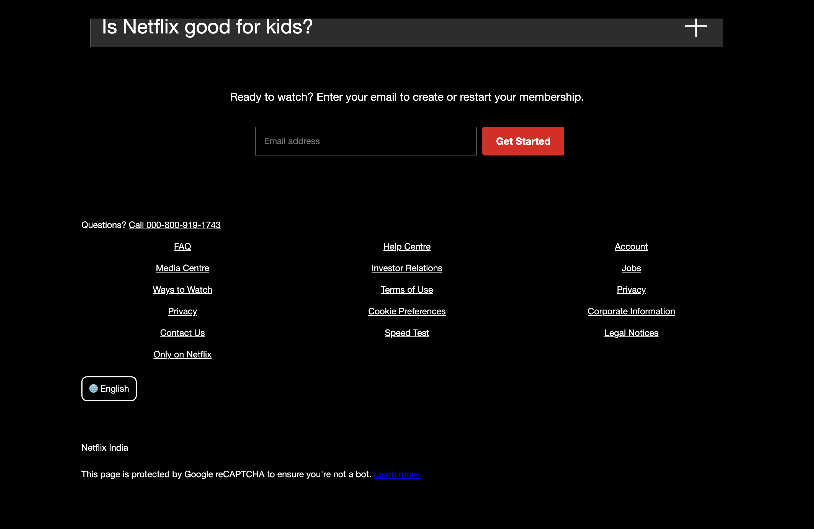
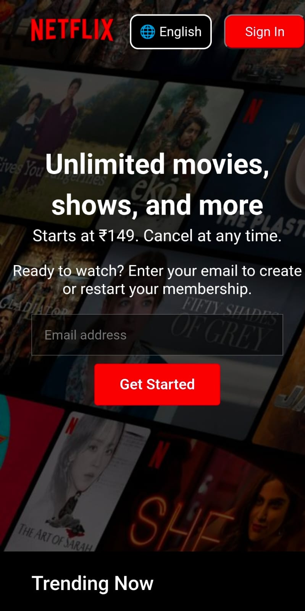
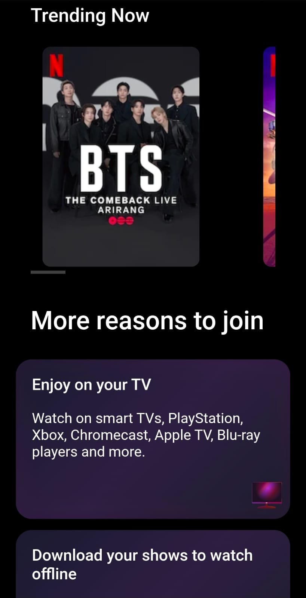

# Netflix-clone-project
A responsive Netflix landing page clone built using HTML, CSS, and JavaScript. Includes modern UI, FAQ accordion, and fully responsive design for mobile, tablet, and desktop.


# 🎬 Netflix Clone

A fully responsive Netflix landing page clone built using HTML, CSS, and JavaScript.

---

## 🚀 Live Demo
👉 https://namanflix-ui-2026.netlify.app/

---

## 📌 Features

- Responsive design (Mobile, Tablet, Desktop)
- Hero section with background image
- FAQ accordion with toggle functionality
- Clean footer layout using CSS Grid
- Modern UI inspired by Netflix

---

## 🛠️ Tech Stack

- HTML5  
- CSS3 (Flexbox + Grid)  
- JavaScript  

---

## 📸 Screenshots

### 🖥️ Home Page


### 📊 Trending & Reasons Section


### ❓ FAQ Section


### 🔻 Footer


### 📱 Mobile View

<p align="center">
  
</p>

<p align="center">
  
</p>

## 🧠 What I Learned

- Responsive design using media queries  
- Flexbox & Grid layouts  
- DOM manipulation with JavaScript  
- Building real-world UI projects  

---

## 📂 Project Structure

```
/assets
index.html
style.css
script.js
```

---

## ⚡ Run Locally

```
git clone https://github.com/NamanNekiye321/netflix-clone-project.git
cd netflix-clone-project
open index.html
```

---

## 📈 Future Improvements

- Add animations  
- Improve accessibility  
- Add backend features  

---

## 👨‍💻 Author

Naman
